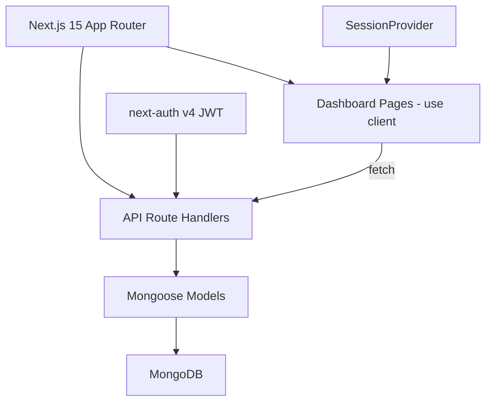
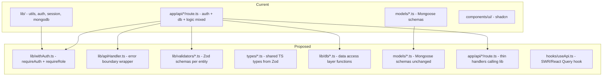

# Gym Management — Architectural Review & Improvement Plan

## Current Architecture Summary



**Stack:** Next.js 15 + App Router, MongoDB/Mongoose, next-auth v4, Radix UI/shadcn, React Hook Form, Zod (unused), Recharts

---

## Critical Issues

### 1. No Input Validation Despite Zod Being Installed

**Severity:** Critical  
**Files:** All `app/api/*/route.ts`

Zod is listed as a dependency but **zero API routes validate request bodies**. Every `POST`/`PUT` handler does `const body = await req.json()` and spreads it directly into Mongoose operations. This allows:
- Arbitrary field injection (clients can set `gymId`, `isActive`, `role`, etc.)
- Missing required fields causing unhandled Mongoose errors
- Type coercion issues (strings instead of numbers)

**Example in** [`app/api/members/route.ts:67`](app/api/members/route.ts:67):
```ts
const body = await req.json();
const member = await Member.create({ ...body, gymId: user.gymId });
```
A client could send `{ "name": "X", "phone": "Y", "role": "admin", "gymId": "other_gym_id" }` and the spread would override the server-set `gymId`.

**Fix:** Create Zod schemas for every entity and validate before Mongoose operations. Strip unknown keys via `z.parse()`.

---

### 2. Massively Duplicated Auth + DB Boilerplate

**Severity:** High  
**Files:** All 13 API route files

Every route handler repeats this 4-line block:
```ts
const session = await getServerSession(authOptions);
const user = getSessionUser(session!);
if (!user) return NextResponse.json({ error: "Unauthorized" }, { status: 401 });
await connectDB();
```

**Fix:** Create an `withAuth` wrapper or a `requireAuth()` helper:

```ts
// lib/withAuth.ts
export async function requireAuth() {
  const session = await getServerSession(authOptions);
  const user = getSessionUser(session!);
  if (!user) throw new AuthError();
  await connectDB();
  return user;
}
```

---

### 3. Inconsistent Auth Patterns Across Routes

**Severity:** High  
**Files:** [`app/api/staff/[id]/route.ts`](app/api/staff/[id]/route.ts) vs all others

The staff `[id]` route manually casts session user instead of using `getSessionUser`:
```ts
// staff/[id]/route.ts line 15
const user = session.user as { id?: string; role?: string };
```
This bypasses the typed `SessionUser` interface and loses the `gymId` field entirely — meaning staff updates have **no gym scope check**.

**Fix:** Use `requireAuth()` everywhere. Never manually cast session user.

---

### 4. Broken RBAC Logic — Superadmin Blocked from Operations

**Severity:** High  
**Files:** [`app/api/members/[id]/route.ts:63`](app/api/members/[id]/route.ts:63), [`app/api/plans/route.ts:32`](app/api/plans/route.ts:32), [`app/api/payments/[id]/route.ts:34`](app/api/payments/[id]/route.ts:34)

The condition `isSuperAdmin(user) || user.role !== "admin"` evaluates to:
- Superadmin → `true || false` → `true` → **Forbidden** (superadmin is blocked!)
- Admin → `false || false` → `false` → Allowed
- Receptionist → `false || true` → `true` → Forbidden

This means superadmins **cannot delete members, create plans, or delete payments**. This is likely a bug — the intent was probably `if (!isSuperAdmin(user) && user.role !== "admin")`.

**Fix:** Create a centralized `requireRole()` or `canPerform()` helper with clear RBAC rules per resource/action.

---

## High Priority Issues

### 5. Settings Model is Dead Code — Redundant with Gym Model

**Severity:** Medium  
**Files:** [`models/Settings.ts`](models/Settings.ts), [`app/api/settings/route.ts`](app/api/settings/route.ts)

`ISettings` has the **exact same fields** as `IGym` (gymName, logo, primaryColor, address, phone, email, currency, expiryReminderDays). The settings API reads/writes the `Gym` collection directly — the `Settings` model is never imported anywhere. This creates confusion about which is the source of truth.

**Fix:** Delete `models/Settings.ts`. Rename `gymName` → `name` in the Gym schema or add a virtual. The settings page should just be a gym-editing page.

---

### 6. No Error Handling in API Routes

**Severity:** High  
**Files:** All API route handlers

Zero try-catch blocks in any route. If Mongoose throws (duplicate key, validation error, cast error), the client gets an unformatted 500 with no useful message.

**Fix:** Wrap route handlers in a centralized error boundary:
```ts
// lib/apiHandler.ts
export function apiHandler(handler) {
  return async (req, ctx) => {
    try {
      return await handler(req, ctx);
    } catch (err) {
      if (err instanceof AuthError) return NextResponse.json(...);
      if (err instanceof z.ZodError) return NextResponse.json(...);
      return NextResponse.json({ error: "Internal server error" }, { status: 500 });
    }
  };
}
```

---

### 7. All Dashboard Pages are Client Components with Manual Data Fetching

**Severity:** Medium  
**Files:** All `app/dashboard/*/page.tsx`

Every page is `"use client"` with `useEffect` + `fetch` + manual `useState` for loading/data/error. This causes:
- Request waterfalls on page load
- No caching or revalidation between navigations
- Manual loading skeleton code repeated in every page
- Stale data after mutations (no automatic revalidation)

**Fix options (pick one):**
- **Option A:** Convert to Server Components with direct DB access (biggest refactor, best performance)
- **Option B:** Add SWR or TanStack Query for client-side caching/revalidation (smaller refactor, good DX)
- **Option C:** Use Next.js `loading.tsx` + `Suspense` boundaries with Server Components

Recommended: **Option B** as a first step (least disruptive), then gradually move to Option A.

---

### 8. No Shared TypeScript Types Between API and Frontend

**Severity:** Medium

Frontend pages define their own interfaces that can drift from API responses:
```ts
// members/page.tsx
interface Member { _id: string; name: string; phone: string; ... }
// members/[id]/page.tsx
interface Member { _id: string; name: string; phone: string; email?: string; ... }
```
Two different `Member` interfaces in two different files, both potentially out of sync with the Mongoose schema.

**Fix:** Create a `types/` directory with shared interfaces derived from Zod schemas:
```
types/
  member.ts    ← export MemberInput, MemberOutput from Zod schemas
  payment.ts
  plan.ts
  staff.ts
  gym.ts
```

---

## Medium Priority Issues

### 9. Invoice Number Generation is Not Concurrency-Safe

**File:** [`lib/utils.ts:52`](lib/utils.ts:52)

```ts
export function generateInvoiceNumber() {
  const rand = Math.floor(1000 + Math.random() * 9000);
  return `INV-${y}${m}-${rand}`;
}
```
`Math.random()` can produce duplicates under concurrent requests. The `unique: true` index catches it, but the error is unhandled (see issue #6).

**Fix:** Use an atomic counter in MongoDB or a UUID-based approach:
```ts
// Option A: Atomic counter
const counter = await Counter.findOneAndUpdate(
  { _id: "invoice" },
  { $inc: { seq: 1 } },
  { upsert: true, returnDocument: "after" }
);
return `INV-${y}${m}-${String(counter.seq).padStart(4, "0")}`;
```

---

### 10. Gym Deletion Does Not Clean Up Related Data

**File:** [`app/api/gyms/[id]/route.ts:78`](app/api/gyms/[id]/route.ts:78)

When a gym is deleted, only staff are deactivated. Members, payments, plans, and activity logs for that gym become orphaned — they reference a non-existent `gymId`.

**Fix:** Either:
- Soft-delete the gym (set `isActive: false`) and cascade-deactivate staff
- Or hard-delete with cleanup: delete all members, payments, plans, logs for that gymId
- Add a `gymId` index cleanup script

---

### 11. Missing Compound Indexes for Common Queries

**Files:** All models

Common query patterns like `{ gymId, membershipExpiry }` and `{ gymId, status: "paid", paidAt }` lack compound indexes. Individual `gymId` indexes exist but compound indexes would be significantly faster for filtered queries.

**Fix:**
```ts
// Member
MemberSchema.index({ gymId: 1, membershipExpiry: 1 });
MemberSchema.index({ gymId: 1, name: "text", phone: "text" });

// Payment
PaymentSchema.index({ gymId: 1, status: 1, paidAt: -1 });
PaymentSchema.index({ gymId: 1, memberId: 1 });
```

---

### 12. Hardcoded Currency Symbol in Frontend

**Files:** [`app/dashboard/payments/new/page.tsx:86`](app/dashboard/payments/new/page.tsx:86), [`app/dashboard/members/new/page.tsx:135`](app/dashboard/members/new/page.tsx:135)

The `₹` symbol is hardcoded in multiple places despite the Gym model having a `currency` field. If a gym uses USD, the UI still shows `₹`.

**Fix:** Pass the gym's currency from session/settings to a `useCurrency()` hook or context, and use `formatCurrency()` consistently.

---

### 13. No Pagination on Staff and Plans Endpoints

**Files:** [`app/api/staff/route.ts:31`](app/api/staff/route.ts:31), [`app/api/plans/route.ts:24`](app/api/plans/route.ts:24)

Staff and Plans return all records with no pagination. As data grows, these endpoints will become slow and transfer large payloads.

**Fix:** Add `page`/`limit` query params consistent with the members/payments pattern.

---

## Low Priority / Nice-to-Have

### 14. next-auth v4 → Auth.js v5 Migration

Using `next-auth@^4.24.11` which is the legacy version. Auth.js v5 is the current recommended version with better Next.js App Router integration, edge compatibility, and typed sessions.

### 15. No Next.js Middleware for Auth

Auth checks happen inside each route handler. Next.js middleware could redirect unauthenticated users before they reach page components, and reject API calls without valid sessions before they hit route handlers.

### 16. No CSRF Protection Beyond next-auth

API routes that accept `POST`/`PUT`/`DELETE` with credentials don't have explicit CSRF protection. next-auth v4 provides some built-in protection, but explicit CSRF tokens would be safer.

### 17. Denormalized Data Without Sync Strategy

`memberName` and `planName` are copied to Payment documents, and `planName` to Member documents. If a member changes their name, historical payments still show the old name. This is acceptable for audit trails but should be documented as intentional.

### 18. No Optimistic Locking for Concurrent Edits

Two admins editing the same member simultaneously will have last-write-wins behavior with no conflict detection. Consider adding a `version` field for optimistic concurrency control.

---

## Proposed Directory Structure



---

## Prioritized Implementation Plan

| Priority | Issue | Effort | Impact |
|----------|-------|--------|--------|
| P0 | #1 Zod validation on all API routes | Medium | Prevents data corruption and injection |
| P0 | #4 Fix RBAC logic (superadmin blocked) | Small | Functional bug — superadmin cannot operate |
| P0 | #6 Add error handling to API routes | Medium | Prevents unhandled 500s |
| P1 | #2 Extract auth/DB boilerplate | Small | Reduces ~100 lines of duplication |
| P1 | #3 Fix inconsistent auth patterns | Small | Security — staff routes lack gym scoping |
| P1 | #5 Remove dead Settings model | Small | Eliminates confusion |
| P1 | #8 Shared TypeScript types | Medium | Prevents frontend/API drift |
| P2 | #7 Add data fetching library (SWR) | Medium | Better UX, caching, revalidation |
| P2 | #9 Fix invoice number generation | Small | Prevents duplicate invoices |
| P2 | #10 Gym deletion cleanup | Small | Prevents orphaned data |
| P2 | #11 Add compound indexes | Small | Query performance |
| P2 | #12 Dynamic currency symbol | Small | Multi-currency support |
| P2 | #13 Add pagination to staff/plans | Small | Performance at scale |
| P3 | #14 Auth.js v5 migration | Large | Modern auth stack |
| P3 | #15 Next.js middleware for auth | Medium | Faster auth rejection |
| P3 | #17 Document denormalization strategy | Small | Clarity |
| P3 | #18 Optimistic locking | Medium | Concurrency safety |

---

## Recommended Implementation Order

1. **Fix the RBAC bug (#4)** — This is a functional bug blocking superadmins
2. **Add Zod validation (#1) + shared types (#8)** — Do these together since Zod schemas generate the types
3. **Extract auth boilerplate (#2) + fix inconsistent auth (#3)** — Refactor all routes to use `requireAuth()`
4. **Add API error handling (#6)** — Wrap routes in `apiHandler()`
5. **Remove Settings model (#5)** — Quick cleanup
6. **Add SWR/TanStack Query (#7)** — Improve all frontend data fetching
7. **Fix invoice generation (#9)** — Prevent production duplicates
8. **Add compound indexes (#11)** — Performance improvement
9. **Gym deletion cleanup (#10)** — Data integrity
10. **Remaining items** — As needed
