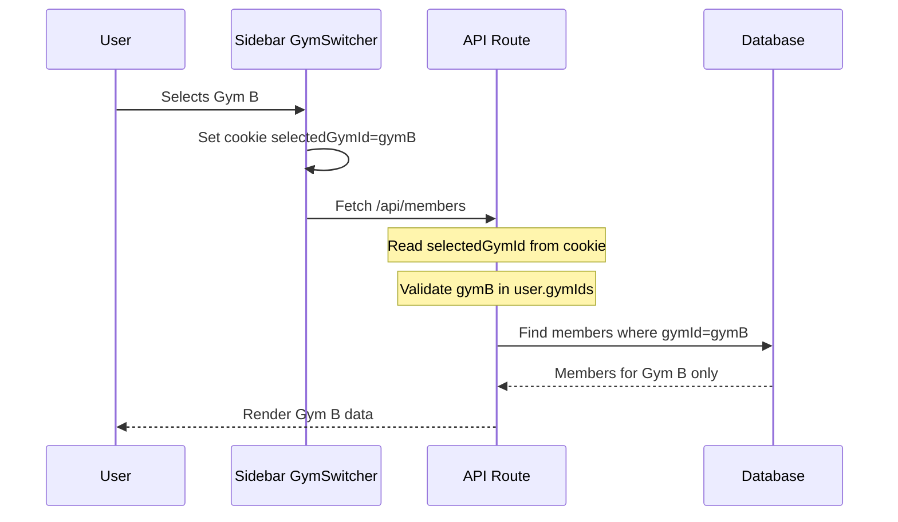
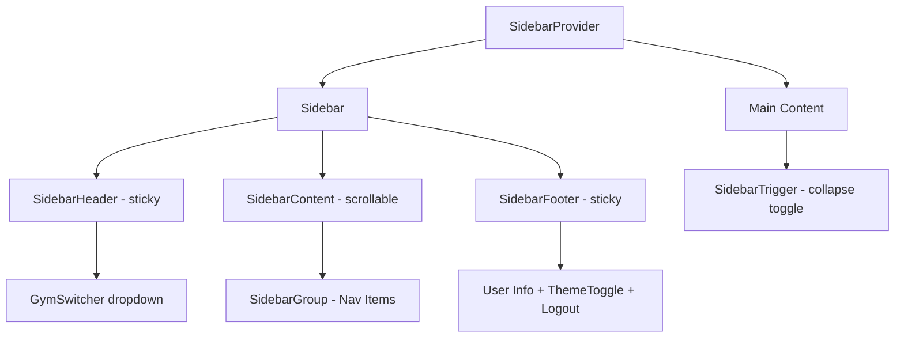
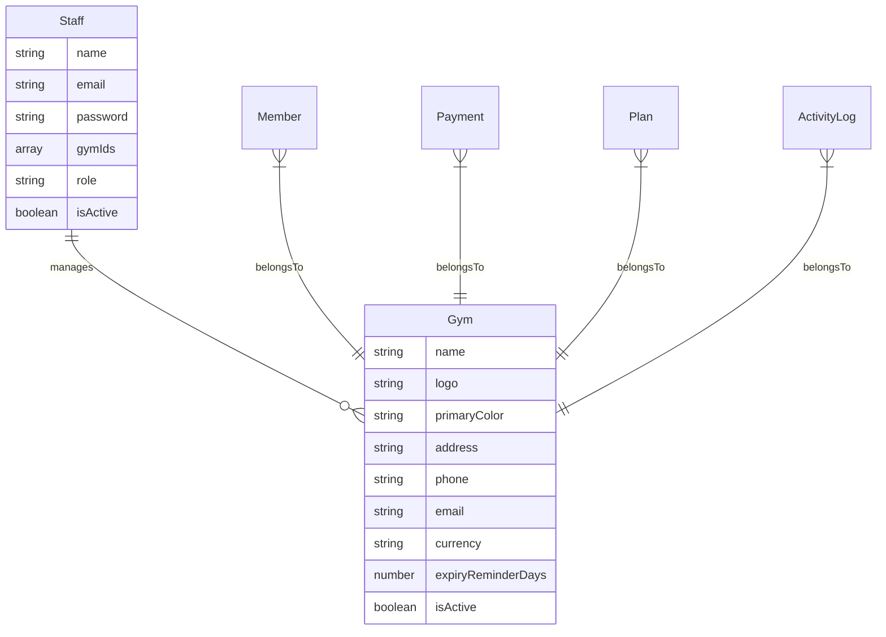

# Multi-Tenant Gym Migration Plan

## Overview

Migrate from a single-gym-per-admin model to a multi-tenant model where each admin can manage multiple gyms. Includes migrating to shadcn/ui Sidebar component, adding a gym switcher, and ensuring strict data isolation per selected gym.

---

## Current State Analysis

### What Already Works
- All gym-scoped models (`Member`, `Payment`, `Plan`, `ActivityLog`) already have `gymId` field with compound indexes
- `getGymFilter()` in [`lib/withAuth.ts`](lib/withAuth.ts:93) already scopes queries by gym
- `GymSettingsProvider` in [`lib/useGymSettings.tsx`](lib/useGymSettings.tsx:1) fetches gym-specific settings
- `Staff.gymId` exists but is a **single** reference — the core limitation

### What Needs to Change
- `Staff.gymId` (single) → `Staff.gymIds` (array) — allows admins to own multiple gyms
- Auth JWT stores single `gymId` → needs `gymIds` array + `selectedGymId`
- Gym CRUD is superadmin-only → admins need to create/manage their own gyms
- Custom sidebar → shadcn/ui Sidebar with built-in collapse, mobile support, and `SidebarHeader` for gym switcher
- All API routes read `user.gymId` → read `selectedGymId` from cookie with access validation

---

## Architecture

### Data Flow: Selected Gym Context



### Component Hierarchy: New Sidebar



### Database Schema Change



---

## Phase 1: Database Schema Changes

### 1.1 Update `Staff` model — `gymId` → `gymIds`

**File:** [`models/Staff.ts`](models/Staff.ts:1)

- Remove `gymId?: mongoose.Types.ObjectId` from `IStaff` interface
- Add `gymIds: mongoose.Types.ObjectId[]` to `IStaff` interface
- Update schema: `gymIds: [{ type: Schema.Types.ObjectId, ref: "Gym", index: true }]`
- Remove old `gymId` field from schema
- Update compound index: `StaffSchema.index({ gymIds: 1, role: 1 })`

### 1.2 Update `Gym` model — add `ownerId`

**File:** [`models/Gym.ts`](models/Gym.ts:1)

- Add `ownerId: mongoose.Types.ObjectId` to `IGym` — references the Staff member who created/owns the gym
- Add to schema: `ownerId: { type: Schema.Types.ObjectId, ref: "Staff", required: true, index: true }`
- This provides a quick lookup: "which gyms does this admin own?"

### 1.3 Write migration script

**New file:** `scripts/migrate-multi-tenant.ts`

- For each Staff document with a `gymId`, convert to `gymIds: [gymId]`
- For Staff with `gymId: null` (superadmins), set `gymIds: []`
- For each Gym, set `ownerId` to the first admin Staff with that `gymId`
- Remove old `gymId` field using `$unset`
- Log counts for verification

### 1.4 Update validators

**File:** [`lib/validators/staff.ts`](lib/validators/staff.ts) — update `gymId` references to `gymIds` array

---

## Phase 2: Auth and Session Changes

### 2.1 Update NextAuth JWT and Session callbacks

**File:** [`lib/auth.ts`](lib/auth.ts:1)

- In `authorize()`: return `gymIds` array instead of single `gymId`
  ```ts
  return {
    id: staff._id.toString(),
    name: staff.name,
    email: staff.email,
    role: staff.role,
    gymIds: staff.gymIds.map(id => id.toString()),
  };
  ```
- In `jwt` callback: store `gymIds` array in token
- In `session` callback: expose `gymIds` array on session user

### 2.2 Update `SessionUser` type

**File:** [`lib/session.ts`](lib/session.ts:1)

```ts
export interface SessionUser {
  id: string;
  name?: string | null;
  email?: string | null;
  role: "superadmin" | "admin" | "receptionist" | "trainer";
  gymIds: string[];       // was: gymId: string | null
  selectedGymId?: string; // currently active gym
}
```

- Remove `gymId: string | null`
- Add `gymIds: string[]`
- Add `selectedGymId?: string`
- Update `isSuperAdmin()`: check `role === "superadmin"` (unchanged)
- Update `requireGymId()`: return `user.selectedGymId!` with validation

### 2.3 Add `selectedGymId` cookie management

**New file:** `lib/selectedGym.ts`

- `setSelectedGymId(gymId: string)` — sets a cookie `selectedGymId` via `/api/auth/select-gym` endpoint
- `getSelectedGymId(req: NextRequest, user: SessionUser): string` — reads cookie, validates access
- Validation: `gymId` must be in `user.gymIds` (or user is superadmin)
- If invalid or missing, default to `user.gymIds[0]`

### 2.4 New API route: Select Gym

**New file:** `app/api/auth/select-gym/route.ts`

- `POST` — accepts `{ gymId }`, validates it's in user's `gymIds`, sets `selectedGymId` cookie
- Returns success with updated gym info (name, logo, etc.)
- Cookie options: `HttpOnly`, `Secure`, `SameSite=Lax`, `Path=/`, `Max-Age=30 days`

### 2.5 Update middleware

**File:** [`middleware.ts`](middleware.ts:1)

- After auth check, if user has `gymIds` but no `selectedGymId` cookie, set it to first gym
- Redirect to gym selection page if user has gyms but none selected (edge case)

---

## Phase 3: API Layer Changes

### 3.1 Update `getGymFilter()`

**File:** [`lib/withAuth.ts`](lib/withAuth.ts:93)

```ts
export function getGymFilter(
  user: SessionUser,
  gymIdParam?: string | null
): Record<string, string> {
  if (isSuperAdmin(user)) {
    return gymIdParam ? { gymId: gymIdParam } : {};
  }
  // Use selectedGymId instead of user.gymId
  const activeGymId = user.selectedGymId || user.gymIds[0];
  if (!activeGymId) throw new ForbiddenError("No gym selected");
  // Security: validate selectedGymId is in user's gymIds
  if (!user.gymIds.includes(activeGymId)) {
    throw new ForbiddenError("Access denied to this gym");
  }
  return { gymId: activeGymId };
}
```

### 3.2 Update `apiHandler` to inject `selectedGymId`

**File:** [`lib/apiHandler.ts`](lib/apiHandler.ts:1)

- After `requireAuth()`, read `selectedGymId` from cookie
- Validate it's in `user.gymIds`
- Set `user.selectedGymId` before passing to handler

### 3.3 Update Gym API routes for admin access

**File:** [`app/api/gyms/route.ts`](app/api/gyms/route.ts:1)

- `GET`: Admin sees only their gyms; superadmin sees all
  ```ts
  if (isSuperAdmin(user)) {
    gyms = await Gym.find({}).sort({ createdAt: -1 }).lean();
  } else {
    gyms = await Gym.find({ _id: { $in: user.gymIds } }).sort({ createdAt: -1 }).lean();
  }
  ```
- `POST`: Allow admin role to create gyms
  - Remove `requireSuperAdmin(user)` — replace with `requireSuperAdminOrRole(user, "admin")`
  - After creating gym, add `gym._id` to creator's `gymIds` array
  - Set `gym.ownerId = user.id`

**File:** [`app/api/gyms/[id]/route.ts`](app/api/gyms/[id]/route.ts:1)

- `GET`: Admin can view their own gyms (check `user.gymIds.includes(id)`)
- `PUT`: Admin can update their own gyms
- `DELETE`: Keep superadmin-only for safety

### 3.4 Update Settings API

**File:** [`app/api/settings/route.ts`](app/api/settings/route.ts:1)

- Use `user.selectedGymId` instead of `user.gymId` for fetching gym settings
- `Gym.findById(user.selectedGymId)` instead of `Gym.findById(user.gymId)`

### 3.5 Update Dashboard API

**File:** [`app/api/dashboard/route.ts`](app/api/dashboard/route.ts:1)

- Replace `user.gymId!` with `user.selectedGymId!` (validated via `getGymFilter`)

### 3.6 Update all other API routes

Every route that uses `user.gymId` directly must switch to `user.selectedGymId` or use `getGymFilter()`:
- [`app/api/members/route.ts`](app/api/members/route.ts)
- [`app/api/payments/route.ts`](app/api/payments/route.ts)
- [`app/api/plans/route.ts`](app/api/plans/route.ts)
- [`app/api/staff/route.ts`](app/api/staff/route.ts)
- [`app/api/reports/route.ts`](app/api/reports/route.ts)
- [`app/api/activity/route.ts`](app/api/activity/route.ts)

Most already use `getGymFilter()` so the change is centralized — but any direct `user.gymId` references must be updated.

---

## Phase 4: Migrate to shadcn/ui Sidebar Component

### 4.1 Install shadcn/ui sidebar

```bash
npx shadcn@latest add sidebar
```

This installs:
- `components/ui/sidebar.tsx` — the full sidebar primitive with `SidebarProvider`, `Sidebar`, `SidebarContent`, `SidebarHeader`, `SidebarFooter`, `SidebarGroup`, `SidebarMenu`, `SidebarMenuItem`, `SidebarMenuButton`, `SidebarTrigger`, etc.
- Built-in collapse/expand with keyboard shortcut (Ctrl+B)
- Mobile-responsive sheet overlay
- Proper ARIA accessibility

### 4.2 Rewrite Sidebar component

**File:** [`components/layout/Sidebar.tsx`](components/layout/Sidebar.tsx:1)

Replace the custom `<aside>` with shadcn/ui primitives:

```tsx
<SidebarProvider>
  <Sidebar collapsible="icon">  {/* "icon" = collapses to icon-only */}
    <SidebarHeader>   {/* Sticky — GymSwitcher goes here */}
    <SidebarContent>  {/* Scrollable — nav items */}
      <SidebarGroup>
        <SidebarMenu>
          {navItems.map(item => (
            <SidebarMenuItem>
              <SidebarMenuButton isActive={active} tooltip={item.label}>
                <item.icon />
                <span>{item.label}</span>
              </SidebarMenuButton>
            </SidebarMenuItem>
          ))}
        </SidebarMenu>
      </SidebarGroup>
    </SidebarContent>
    <SidebarFooter>   {/* Sticky — user info, theme toggle, logout */}
  </Sidebar>
  <main>
    <SidebarTrigger />  {/* Built-in collapse toggle */}
    {children}
  </main>
</SidebarProvider>
```

Key benefits over current custom sidebar:
- **Built-in collapse** with `collapsible="icon"` — collapses to icon-only rail
- **Mobile responsive** — automatically becomes a sheet overlay on small screens
- **Keyboard shortcut** — Ctrl+B to toggle
- **Proper ARIA** — screen reader support out of the box
- **SidebarHeader** — sticky by default, perfect for gym switcher
- **SidebarFooter** — sticky by default, user info stays visible
- **`useSidebar()`** hook — any component can read/toggle sidebar state

### 4.3 Update Dashboard Layout

**File:** [`app/dashboard/layout.tsx`](app/dashboard/layout.tsx:1)

- Wrap with `SidebarProvider` (move from Providers or keep here)
- Replace `<div className="flex h-screen">` with `SidebarProvider` + `SidebarInset`
- Add `SidebarTrigger` in the main content area for collapse toggle

### 4.4 Preserve existing visual design

- Keep the orange gradient logo container
- Keep pill-style active states (via `SidebarMenuButton isActive` + custom CSS)
- Keep `AnimatePresence` animations for nav text (add as custom styling on top of shadcn base)
- Keep `ThemeToggle` in `SidebarFooter`
- Keep user avatar in `SidebarFooter`

---

## Phase 5: Build GymSwitcher Component

### 5.1 New component: `GymSwitcher`

**New file:** `components/layout/GymSwitcher.tsx`

A dropdown in `SidebarHeader` that shows the currently selected gym and allows switching:

```
┌─────────────────────────┐
│ [🏋️ Logo] Gym Name    ▼│  ← Click to open dropdown
├─────────────────────────┤
│ 🏋️ Gym A               │  ← Checkmark if selected
│ 🏋️ Gym B          ✓   │
│ ─────────────────────── │
│ + Add New Gym           │  ← Opens gym creation dialog
└─────────────────────────┘
```

Features:
- Shows gym logo (or first-letter avatar fallback with gym's `primaryColor` as background)
- Dropdown with all gyms the admin manages
- Checkmark on currently selected gym
- "Add New Gym" option at bottom
- When collapsed, shows only the gym logo/icon
- Calls `POST /api/auth/select-gym` on selection
- On success, updates cookie and triggers full page data refresh via `router.refresh()` or SWR mutation
- Uses shadcn `DropdownMenu` or `Command` component

### 5.2 Gym logo display component

**New file:** `components/ui/gym-avatar.tsx`

- If `logo` URL exists: show `<AvatarImage src={logo} />`
- If no logo: show `<AvatarFallback>` with first letter of gym name
- Background color: gym's `primaryColor` (or default orange)
- Used in GymSwitcher, gym management pages, invoices, etc.

### 5.3 Integrate GymSwitcher into Sidebar

In the new `Sidebar.tsx`:
```tsx
<SidebarHeader className="border-b p-2">
  <GymSwitcher />
</SidebarHeader>
```

---

## Phase 6: Gym Management UI for Admins

### 6.1 New page: `/dashboard/gyms`

**New file:** `app/dashboard/gyms/page.tsx`

- List all gyms the admin manages (card grid layout)
- Each card shows: logo, name, address, member count, status
- "Add Gym" button
- Edit/Delete actions (delete = superadmin only)
- Uses `PageHeader`, `StatCard`-style cards, `Avatar` for gym logo

### 6.2 Add to sidebar navigation

**File:** `components/layout/Sidebar.tsx`

Add to `gymNavItems`:
```ts
{ href: "/dashboard/gyms", label: "My Gyms", icon: Building2 },
```

Place it after Dashboard, before Members.

### 6.3 Gym creation dialog

- Reuse the existing dialog pattern from [`app/dashboard/superadmin/gyms/page.tsx`](app/dashboard/superadmin/gyms/page.tsx)
- Add logo upload field (file input → base64 or upload endpoint)
- On create: POST `/api/gyms` → gym appears in GymSwitcher immediately
- No need for "admin credentials" section since the creator IS the admin

### 6.4 Logo upload strategy

**Option A: Base64 in document** (recommended for MVP)
- Store logo as base64 data URI in `Gym.logo` field
- Simple, no external storage dependency
- Limit: ~500KB per logo (validate on upload)

**Option B: Cloud storage** (future enhancement)
- Upload to S3/Cloudinary
- Store URL in `Gym.logo`
- Add upload API route: `POST /api/upload`

For now, use Option A. The `Gym.logo` field already exists as a string.

### 6.5 Update superadmin gyms page

**File:** [`app/dashboard/superadmin/gyms/page.tsx`](app/dashboard/superadmin/gyms/page.tsx)

- Add gym logo display using `GymAvatar` component
- Show owner admin name (populate `ownerId`)
- Keep existing CRUD functionality

---

## Phase 7: Data Isolation Verification and Testing

### 7.1 Security audit checklist

- [ ] Every API route that returns gym-scoped data uses `getGymFilter()` or equivalent
- [ ] No route directly uses `user.gymId` (old field) — all use `selectedGymId`
- [ ] `selectedGymId` cookie is validated against `user.gymIds` on every request
- [ ] Admin cannot switch to a gym they don't own
- [ ] Superadmin can still view all gyms with optional `?gymId=` filter
- [ ] Staff creation is scoped to the selected gym
- [ ] Member/Payment/Plan CRUD is scoped to the selected gym

### 7.2 Integration test scenarios

1. Admin with 2 gyms — switch between them, verify data isolation
2. Admin creates a new gym — verify it appears in GymSwitcher
3. Receptionist logs in — verify they see only their assigned gym's data
4. Superadmin views aggregate data across all gyms
5. Cookie tampering — set `selectedGymId` to an unauthorized gym, verify 403

### 7.3 Edge cases to handle

- Admin with 0 gyms (new admin, not assigned yet) — show "No gyms" state with CTA to create one
- Admin's last gym is deactivated — redirect to gym selection
- Superadmin has no `gymIds` — they use the `?gymId=` param pattern (unchanged)
- Receptionist/Trainer with multiple gyms — they see GymSwitcher too

---

## File Change Summary

| File | Change Type | Description |
|------|------------|-------------|
| `models/Staff.ts` | Modify | `gymId` → `gymIds` array |
| `models/Gym.ts` | Modify | Add `ownerId` field |
| `lib/auth.ts` | Modify | JWT/session store `gymIds` array |
| `lib/session.ts` | Modify | Update `SessionUser` type |
| `lib/withAuth.ts` | Modify | Update `getGymFilter()` for `selectedGymId` |
| `lib/apiHandler.ts` | Modify | Inject `selectedGymId` from cookie |
| `lib/validators/staff.ts` | Modify | Update `gymId` → `gymIds` in schemas |
| `lib/validators/gym.ts` | Modify | Add `ownerId` optional field |
| `middleware.ts` | Modify | Set default `selectedGymId` cookie |
| `components/layout/Sidebar.tsx` | Rewrite | Migrate to shadcn/ui Sidebar |
| `components/layout/GymSwitcher.tsx` | New | Gym switcher dropdown |
| `components/ui/gym-avatar.tsx` | New | Gym logo/initials avatar |
| `components/ui/sidebar.tsx` | New | shadcn/ui sidebar primitive (via CLI) |
| `app/dashboard/layout.tsx` | Modify | Wrap with SidebarProvider |
| `app/dashboard/gyms/page.tsx` | New | Admin gym management page |
| `app/api/auth/select-gym/route.ts` | New | Set selected gym cookie |
| `app/api/gyms/route.ts` | Modify | Allow admin CRUD on own gyms |
| `app/api/gyms/[id]/route.ts` | Modify | Admin access to own gyms |
| `app/api/settings/route.ts` | Modify | Use `selectedGymId` |
| `app/api/dashboard/route.ts` | Modify | Use `selectedGymId` |
| `app/api/staff/route.ts` | Modify | Use `selectedGymId` for scoping |
| `lib/useGymSettings.tsx` | Modify | Fetch settings for selected gym |
| `scripts/migrate-multi-tenant.ts` | New | Migration script for existing data |

---

## Implementation Order

The phases should be executed in order since each depends on the previous:

1. **Phase 1** (DB schema) — must come first; all other changes depend on the new schema
2. **Phase 2** (Auth/session) — depends on new schema; must come before API changes
3. **Phase 3** (API layer) — depends on new auth flow; must come before UI
4. **Phase 4** (shadcn Sidebar) — independent of multi-tenant logic; can be done in parallel with Phase 3
5. **Phase 5** (GymSwitcher) — depends on Phase 3 + 4; the key UI feature
6. **Phase 6** (Gym management UI) — depends on Phase 3 + 5
7. **Phase 7** (Testing) — after all changes are complete

**Phases 3 and 4 can be done in parallel** since they touch different files (API vs UI).
